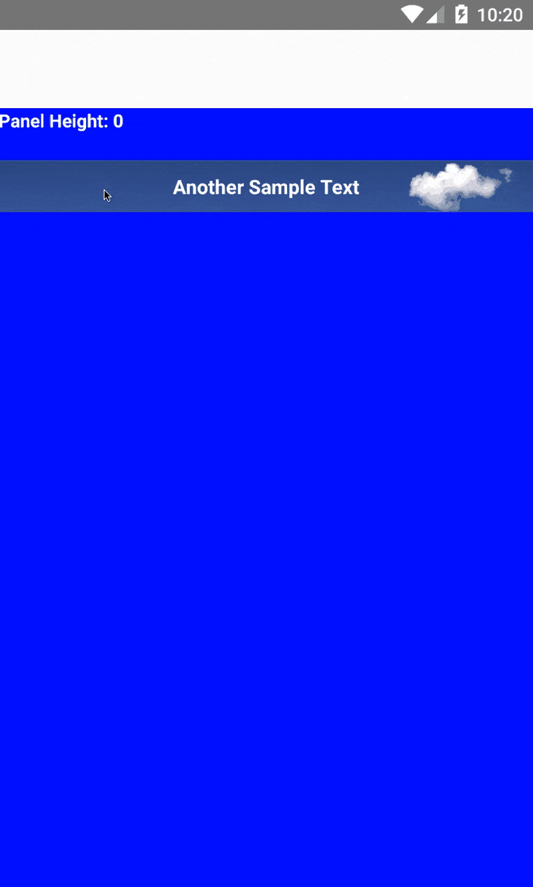

# React native slide down panel (ios + android)

Inspired by [react-native-sliding-up-panel](https://github.com/ninamanalo19/react-native-sliding-up-panel).

[](https://badge.fury.io/js/react-native-slide-down-panel)

## Installation

```
npm i react-native-slide-down-panel -S
```

## Demo

Look at [/examples/example](examples/example) for usage. You will need the react-native cli installed to run the example.

- download the repo
- `cd examples/example`
- `npm install`
- `react-native run-ios` or `react-native run-android`

## Changelog

See at [changelogs](CHANGELOG.md) latest changes.

## Demo GIF

<p align="center">
    
</p>

<br>


## License

react-native-slide-down-panel is available under the MIT license. See the LICENSE file for more info.
